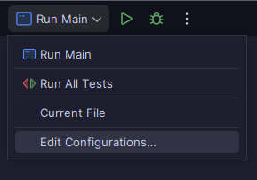

# Board Game project IDATT2003

### Students
| Name                             | Student ID |
|----------------------------------|------------|
| Aleksander Hjortkær Sand Evensen | 129194     |
| Yazan Zarka                      | 530542     |


## Project description

This project is a GUI based board game application for different kinds of board games. Made as the primary assignment in IDATT2003 (Programmering 2) course at NTNU

## System Requirements

- Java JDK 21 or higher
- JavaFX 21 or higher
- Maven for building and running (alternatively, IDE with Maven support)

## Project structure

```
$ tree .

custom-games            - Contains custom games not loaded by engine
└── path-of-exile.json  - A ladder style game

data                - Directory for dynamic data loading
├── audio           - Audio files loaded by the Game AudioManager
├── games           - JSON Game definitions automatically loaded
├── images          - Banner Images for games
├── players.csv     - The file that contains the player save data
└── questions.json  - Questions used on the Quiz Tile Action

src
├── main
│   ├── java
│   │   └── edu.ntnu.idi.idatt.boardgame
│   │       ├── core                    - Core utilities and framework components
│   │       │   ├── filesystem          - File I/O operations
│   │       │   ├── reactivity          - Observable pattern implementation
│   │       │   └── router              - Application navigation system
│   │       ├── javafx                  - JavaFX UI implementation
│   │       │   ├── animation           - Animation effects
│   │       │   ├── audio               - Game sound management
│   │       │   ├── components          - Reusable UI components
│   │       │   ├── providers           - Service providers for UI (ToastProvider)
│   │       │   ├── style               - Tile style resolvers for JavaFX
│   │       │   ├── controllers         - Game View controllers
│   │       │   └── view                - Game Views
│   │       ├── model                   - Core game model
│   │       │   ├── actions             - Tile action implementations
│   │       │   ├── entities            - Game domain objects
│   │       │   ├── events              - Game event definitions
│   │       │   ├── factories           - Object creation
│   │       │   │   └── adapters        - GSON Json Mapping classes
│   │       │   ├── managers            - Game state management
│   │       │   └── style               - Tile styling definitions
│   │       │
│   │       └── Application.java        - Main application entry point
│   │
│   └── resources                       - Interal Static resources
│       ├── images                      - Images
│       ├── styles                      - CSS styling
│       │   ├── components              - Component-specific styles
│       │   └── views                   - View-specific styles
│       ├── main.css                    - Main application styling
│       ├── theme.css                   - Dark Theme definitions
│       └── theme-light.css             - Light Theme definitions
│
└── test
    └── java
        └── edu.ntnu.idi.idatt.boardgame - Test suite
            ├── actions                   - Tests for game actions
            ├── core                      - Tests for core utilities
            ├── game                      - Game logic tests
            ├── model                     - Model component tests
            └── router                    - Navigation tests
```

## Link to repository

https://github.com/AleksanderEvensen/IDATT2003-BoardGame

## How to run the project

### Run using maven

```sh
mvn javafx:run
```

### Run using IntelliJ

The IntelliJ `Run Application` and `Run All Tests` should be bundled with the repository
under `.idea/runConfigurations`



## How to run the tests

### Using maven

Run the tests using maven by executing:

```sh
mvn test
```

### Using IntelliJ

The IntelliJ `Run Application` and `Run All Tests` should be bundled with the repository
under `.idea/runConfigurations`


## Features

- Multiple game types supported: Snakes and Ladders, Bezzerwizzer, and custom games
- Player management system with persistent player statistics
- Dynamic game loading from JSON definitions
- Theme support (light and dark themes)
- Sound effects and animations
- Quiz functionality with custom questions

## Game Types

### Ladder (Snakes and Ladders)
A classic board game where players race to the top of the board, climbing ladders and sliding down snakes.

### Bezzerwizzer
A quiz-based game where players answer questions to advance.

### Custom Games
The application supports loading custom game definitions from JSON files. See the "Creating Custom Games" section below.

## Creating Custom Games

You can create your own games by adding JSON definition files to the `data/games/` directory. The engine will automatically load these at startup.

Example game definition format:
```json
{
  "id": "<unique_id>",
  "name": "My Custom Game",
  "description": "A fun custom game",
  "minPlayers": 2, // Minimum amount of players
  "maxPlayers": 4, // Max amount of players
  "numberOfDice": 1, // How many dices
  "imagePath": "<abolute_relative_image_path>", // Banner image
  "board": {
    // Board Size
    "rowCount": 10, 
    "colCount": 10,
    // Tile definitions
    "tiles": {
      // 0 is always first tile
      "0": {
        "tileId": 0,
        "row": 0,
        "col": 0,
        "nextTileId": 1,
        "previousTileId": null
      },
      "1": {
        "tileId": 1,
        "row": 0,
        "col": 1,
        "nextTileId": 2,
        "previousTileId": 0,
        "action": {
          "type": "", // "LADDER", "QUIZ", "FREEZE", "IMMUNITY"
          
          "destinationTileId": 0, // Optional, but required for the LADDER action
          
          // Optional, but required for the QUIZ action
          // Allowed Values: 
          //     "RANDOM", "GENERAL_KNOWLEDGE", "SCIENCE", "HISTORY"
          //     "GEOGRAPHY", "ENTERTAINMENT", "ART", "SPORTS"
          "category": "" 
        }
      },
      "3": {
        "tileId": 3,
        "row": 0,
        "col": 2,
        "previousTileId": 1,
        "nextTileId": -1, // NO next tile
        "action": {
          "type": "GOAL" // Indicates finish line
        }
      }
    }
  }
}

```

## Data Files

### Players (data/players.csv)
Contains player info data in CSV format.

### Questions (data/questions.json)
Contains quiz questions for use with the Quiz tile action.

## Themes

- `theme.css` - Dark theme (default)
- `theme-light.css` - Light theme

- `theme-fetcher.ts` - TypeScript script for fetching themes from Catppuccin Repo 

You can switch between themes in the application.

